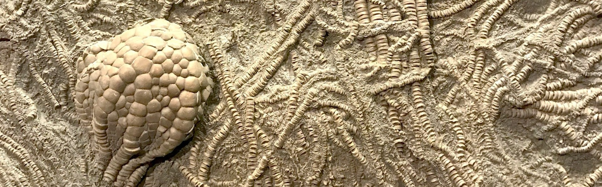

# Awesome Paleontology 

_A curated[^curation_details] list of awesome resources on paleontology[^definition_paleontology]._

[^definition_paleontology]: (from Wikipedia, see citation at the bottom) **Paleontology** or **palaeontology** is the scientific study of the life of the past, mainly but not exclusively through the study of [fossils](https://en.wikipedia.org/wiki/Fossils "Fossils"). Paleontologists use fossils as a means to classify [organisms](https://en.wikipedia.org/wiki/Organisms "Organisms"), measure [geologic time](https://en.wikipedia.org/wiki/Geologic_time "Geologic time"), and assess the interactions between [prehistoric](https://en.wikipedia.org/wiki/Prehistoric "Prehistoric") organisms and their [natural environment](https://en.wikipedia.org/wiki/Natural_environment "Natural environment"). While paleontological observations are known from at least the 6th century BC, the foundation of paleontology as a science dates back to the work of [Georges Cuvier](https://en.wikipedia.org/wiki/Georges_Cuvier "Georges Cuvier") in [1796](https://en.wikipedia.org/wiki/1796_in_paleontology "1796 in paleontology"). Cuvier demonstrated evidence for the concept of [extinction](https://en.wikipedia.org/wiki/Extinction "Extinction") and how life of the past was not necessarily the same as that of the present. The field developed rapidly over the course of the following decades, and the French word _paléontologie_ was introduced for the study in [1822](https://en.wikipedia.org/wiki/1822_in_paleontology "1822 in paleontology"), which was derived from the [Ancient Greek](https://en.wikipedia.org/wiki/Ancient_Greek "Ancient Greek") word for 'ancient' and words describing relatedness and a field of study. Further advances in the field accompanied the work of [Charles Darwin](https://en.wikipedia.org/wiki/Charles_Darwin "Charles Darwin") who popularized the concept of [evolution](https://en.wikipedia.org/wiki/Evolution "Evolution"). Together, evolution and extinction can be understood as complementary processes which shaped the [history of life](https://en.wikipedia.org/wiki/History_of_life "History of life"). Paleontology overlaps the most with the fields of [geology](https://en.wikipedia.org/wiki/Geology "Geology") and [biology](https://en.wikipedia.org/wiki/Biology "Biology"). It draws on technology and analysis of a wide range of sciences to apply them to the study of life and environments of the past, particularly for the subdisciplines of [paleobiology](https://en.wikipedia.org/wiki/Paleobiology "Paleobiology") and [paleoecology](https://en.wikipedia.org/wiki/Paleoecology "Paleoecology") that are analogous to biology and [ecology](https://en.wikipedia.org/wiki/Ecology "Ecology"). Paleontology also contributes to other sciences, being utilized for [biostratigraphy](https://en.wikipedia.org/wiki/Biostratigraphy "Biostratigraphy") to reconstruct the [geologic time scale](https://en.wikipedia.org/wiki/Geologic_time_scale "Geologic time scale") of Earth, or in studies on extinction to establish both external and internal factors that can lead to the disappearance of a [species](https://en.wikipedia.org/wiki/Species "Species"). Much of the history of life is now better understood because of advances in paleontology and the increase of [interdisciplinary studies](https://en.wikipedia.org/wiki/Interdisciplinary_studies "Interdisciplinary studies"). Several improvements in understanding have occurred from the introduction of theoretical analysis to paleontology in the 1950s and 1960s that led to the rise of more focused fields of paleontology that assess the changing [geography](https://en.wikipedia.org/wiki/Geography "Geography") and [climate](https://en.wikipedia.org/wiki/Climate "Climate") of Earth, the [phylogenetic](https://en.wikipedia.org/wiki/Phylogenetic "Phylogenetic") relationships between different species, and the analysis of how [fossilization](https://en.wikipedia.org/wiki/Fossilization "Fossilization") occurs and what biases can impact the quality of the [fossil record](https://en.wikipedia.org/wiki/Fossil_record "Fossil record"). Paleontology is also one of the most high profile of the sciences, comparable to [astrophysics](https://en.wikipedia.org/wiki/Astrophysics "Astrophysics") and [global health](https://en.wikipedia.org/wiki/Global_health "Global health") in the amount of attention in [mass media](https://en.wikipedia.org/wiki/Mass_media "Mass media"). Public attention to paleontology can be traced back to the [mythologies](https://en.wikipedia.org/wiki/Mythologies "Mythologies") of [indigenous peoples](https://en.wikipedia.org/wiki/Indigenous_peoples "Indigenous peoples") of many continents and the interpretation of discovered fossils as the bones of [dragons](https://en.wikipedia.org/wiki/Dragon "Dragon") or [giants](https://en.wikipedia.org/wiki/Giant "Giant"). Prehistoric life is used as the inspiration for [toys](https://en.wikipedia.org/wiki/Toys "Toys"), television and [film](https://en.wikipedia.org/wiki/Film "Film"), [computer games](https://en.wikipedia.org/wiki/Computer_games "Computer games"), and [tourism](https://en.wikipedia.org/wiki/Tourism "Tourism"), with the budgets for these public projects often exceeding the funding within the field of paleontology itself. This has led to exploitation and [imperialism](https://en.wikipedia.org/wiki/Imperialism "Imperialism") of fossils collected for institutions in Europe and North America, and also appeals to the public for sponsorships to the benefit of some areas of paleontology at the detriment of others. CITATION: Wikipedia contributors. "Paleontology." Wikipedia. Last modified October 24, 2025. Accessed October 24, 2025. <https://en.wikipedia.org/wiki/Paleontology>.

 [^image_attribution]

[^image_attribution]: Image used under the [Unsplash License](https://unsplash.com/license), i.e. "All images can be downloaded and used for free", "Commercial and non-commercial purposes", and "No permission needed (though attribution is appreciated!)". Image Link: <https://unsplash.com/photos/brown-and-white-pine-cones-on-brown-sand-Ca6SEzOGJDw>. Image Photographer: [Gabi Scott](https://unsplash.com/@gabrielle_ellecreative).

[^curation_details]: This list follows specific scoping guidelines. **Databases & Data Repositories** includes fossil occurrence databases, specimen repositories, and paleoecological databases. **Software & Analysis Tools** covers statistical software, workflow tools, and R packages for paleobiological analysis. **Organizations & Societies** lists professional paleontological societies. **Journals & Publications** features open access and subscription journals in paleontology. **Educational Resources** includes museum resources, educational platforms, and outreach programs. **Imaging & Visualization** covers digital imaging, micro-CT, and 3D morphology tools. **Field Resources** includes safety guides, regulations, and reference timescales. **Collections Management** lists museum collection management systems.

## Contents

- [Databases & Data Repositories](#databases--data-repositories)
- [Software & Analysis Tools](#software--analysis-tools)
- [Organizations & Societies](#organizations--societies)
- [Journals & Publications](#journals--publications)
- [Educational Resources](#educational-resources)
- [Imaging & Visualization](#imaging--visualization)
- [Field Resources](#field-resources)
- [Collections Management](#collections-management)
- [People](#people)
- [Related Awesome Lists](#related-awesome-lists)

## Databases & Data Repositories

1. [Paleobiology Database (PBDB)](https://paleobiodb.org/): Open-access database maintained by an international group with global fossil occurrence and taxonomic data for all geological ages.
2. [Integrated Digitized Biocollections (iDigBio)](https://www.idigbio.org/): Data and images for millions of biological specimens including fossils, available in electronic format.
3. [MorphoBank](https://morphobank.org/): Repository for phenotypic datasets, hosting phylogenetic character matrices and 2D specimen images.
4. [Neotoma Paleoecology Database](https://neotomadb.org/): Community-curated database for paleoecology with pollen, diatoms, ostracodes, vertebrates, and other proxy data.
5. [Pangaea](https://www.pangaea.de/): Open access data publisher for earth and environmental sciences, including paleontological data.
6. [Fossilworks](http://fossilworks.org/): Gateway to the Paleobiology Database with user-friendly interface and enhanced search features.

## Software & Analysis Tools

1. [PAST (PAleontological STatistics)](https://www.nhm.uio.no/english/research/infrastructure/past/): Free statistical analysis package designed for paleontological data analysis.
2. [Paleopal](https://github.com/willgearty/paleopal): Browser-based workflow tool for fossil data analysis.
3. [Avizo Software](https://www.thermofisher.com/avizo-paleontology): 3D visualization and analysis for digitally dissecting and measuring paleontological samples.
4. [Paleobiology Database Navigator](https://paleobiodb.org/navigator/): Interactive visualization tool for exploring fossil occurrences by time, space, and taxonomy.
5. [paleotree](https://github.com/dwbapst/paleotree): R package for paleontological and phylogenetic analyses of evolution.
6. [divDyn](https://github.com/adamkocsis/divDyn): R package for diversity dynamics using fossil occurrence data.
7. [PaleoPhyloR](https://github.com/graemetlloyd/Claddis): R package for phylogenetic paleobiology.
8. [fossilbrush](https://github.com/palaeoverse/fossilbrush): R package for cleaning and preparing fossil occurrence data.
9. [palaeoverse](https://github.com/palaeoverse/palaeoverse): R package for preparing and exploring paleobiological data.
10. [chronosphere](https://github.com/adamkocsis/chronosphere): R package for spatiotemporal data in Earth sciences.
11. [paleobuddy](https://github.com/brpetrucci/paleobuddy): R package for simulating diversification and fossil sampling.
12. [paleobioDB R package](https://github.com/ropensci/paleobioDB): R interface to Paleobiology Database.
13. [Morpho](https://github.com/zarquon42b/Morpho): R package for geometric morphometrics.
14. [phytools](https://github.com/liamrevell/phytools): R package for phylogenetic comparative methods.
15. [strap](https://github.com/graemetlloyd/strap): R package for stratigraphic tree analysis.
16. [rgplates](https://github.com/adamkocsis/rgplates): R package interface to GPlates Web Service.
17. [GPlates](https://github.com/GPlates): Software for interactive visualization of plate tectonics.
18. [paleoMap](https://github.com/scotese/paleoMap): Tools for paleogeographic reconstructions.
19. [Mesquite](https://www.mesquiteproject.org/): Software for phylogenetic analysis and character evolution.
20. [MorphoJ](https://morphometrics.uk/MorphoJ_page.html): Integrated software for geometric morphometrics.
21. [TNT](http://www.lillo.org.ar/phylogeny/tnt/): Tree analysis for phylogenetic inference.
22. [BEAST](https://beast.community/): Bayesian evolutionary analysis by sampling trees.
23. [FigTree](http://tree.bio.ed.ac.uk/software/figtree/): Graphical viewer of phylogenetic trees.
24. [PaleoGIS](https://www.paleogis.com/): Geographic information systems for paleogeography.
25. [GeoMapApp](http://www.geomapapp.org/): Marine geospatial data exploration tool.
26. [Climate Data Analysis Tools](https://www.ncdc.noaa.gov/data-access): NOAA paleoclimate data tools.
27. [Paleoclimate Modelling Intercomparison Project](https://pmip.lsce.ipsl.fr/): Climate modeling software and data.

## Organizations & Societies

1. [The Paleontological Society](https://paleosoc.org/): Professional society offering publications, grants, awards, and outreach programs.
2. [Society of Vertebrate Paleontology](https://vertpaleo.org/): Professional organization for vertebrate paleontology with resources for educators, students, and researchers.
3. [Palaeontological Association](https://www.palass.org/): International organization publishing _Palaeontology_ and _Papers in Palaeontology_.
4. [International Palaeontological Association](https://ipa-online.org/): Global organization coordinating international paleontological congresses.

## Journals & Publications

### Open Access Journals

1. [Palaeontologia Electronica](https://palaeo-electronica.org/): Free, peer-reviewed electronic journal sponsored by the Society of Vertebrate Paleontology.
2. [Acta Palaeontologica Polonica](https://www.app.pan.pl/): Diamond open access international journal with DOAJ Seal.
3. [Swiss Journal of Palaeontology](https://www.springer.com/journal/13358): Open access journal with focus on systematic paleontology.
4. [PLOS ONE - Paleontology](https://journals.plos.org/plosone/): Open access articles on paleontology.

### Subscription Journals

1. [Journal of Paleontology](https://www.cambridge.org/core/journals/journal-of-paleontology): Official journal of the Paleontological Society, published by Cambridge University Press.
2. [Paleobiology](https://www.cambridge.org/core/journals/paleobiology): Focuses on biological aspects of the fossil record, published by the Paleontological Society.
3. [Palaeontology](https://www.palass.org/publications/palaeontology-journal): Published by the Palaeontological Association.
4. [Journal of Vertebrate Paleontology](https://www.tandfonline.com/journals/ujvp20): Published by Taylor & Francis for the Society of Vertebrate Paleontology.
5. [Palaeogeography, Palaeoclimatology, Palaeoecology](https://www.journals.elsevier.com/palaeogeography-palaeoclimatology-palaeoecology): Multidisciplinary earth science journal published by Elsevier.
6. [Cretaceous Research](https://www.journals.elsevier.com/cretaceous-research): Elsevier journal focused on the Cretaceous Period.

## Educational Resources

1. [University of California Museum of Paleontology](https://ucmp.berkeley.edu/): Comprehensive collection of educational materials and online exhibits.
2. [Smithsonian National Museum of Natural History - Paleobiology](https://naturalhistory.si.edu/research/paleobiology): Resources and collections information.
3. [Digital Atlas of Ancient Life](https://www.digitalatlasofancientlife.org/): 3D models and educational materials.
4. [Understanding Evolution](https://evolution.berkeley.edu/): Educational resource on evolution and the fossil record.
5. [MyFossil.org](https://www.myfossil.org/): Educational platform connecting fossil enthusiasts with paleontologists.
6. [Paleontological Society Outreach Guide](https://paleosoc.org/outreach): Community engagement and educational resources.
7. [Paleocast](http://www.paleocast.com/): Podcast discussing paleontology research.
8. [Paleontology: Ancient Marine Reptiles (Coursera)](https://www.coursera.org/learn/ancient-marine-reptiles): University of Alberta course on marine reptile evolution.
9. [Paleontology: Theropod Dinosaurs and the Origin of Birds (Coursera)](https://www.coursera.org/learn/dino101): University of Alberta dinosaur evolution course.
10. [MIT OpenCourseWare - Earth Sciences](https://ocw.mit.edu/courses/earth-atmospheric-and-planetary-sciences/): Course catalog including paleontology-related courses.
11. [Yale Open Courses - Ecology & Evolutionary Biology](https://oyc.yale.edu/ecology-and-evolutionary-biology): Open courses covering evolutionary history.
12. [History of Earth (Coursera)](https://www.coursera.org/learn/history-earth): University of Copenhagen course covering paleontology and geology.

## Imaging & Visualization

1. [3DHISTECH Paleontology Solutions](https://www.3dhistech.com/paleontology): Digital imaging and AI-driven analysis for fossil research.
2. [Pannoramic-X Micro-CT Scanner](https://www.3dhistech.com/pannoramic-x): Non-destructive 3D imaging of fossils using soft X-ray micro-CT.
3. [MorphoSource](https://www.morphosource.org/): 3D morphology data archive for researchers to share datasets.

## Field Resources

1. [Society of Vertebrate Paleontology Field Safety Guide](https://vertpaleo.org/resources/safety/): Best practices for fieldwork safety.
2. [Paleontological Resources Preservation Act (PRPA)](https://www.blm.gov/programs/cultural-heritage-and-paleontology/paleontology): U.S. federal regulations for fossil collection on public lands.
3. [Geological Time Scale](https://stratigraphy.org/timescale/): International Commission on Stratigraphy official timescale.

## Collections Management

1. [Arctos](https://arctos.database.museum/): Collections management system used by biological and paleontology collections worldwide.
2. [Specify Software](https://www.specifysoftware.org/): Collection management system with web version (Specify 7).
3. [EMu](https://emu.axiell.com/): Collections management platform used by natural history museums.

## People

- [David Bapst](https://github.com/dwbapst) - Creator and maintainer of paleotree, an R package for paleontological and phylogenetic analyses of evolution.
- [Adam Kocsis](https://github.com/adamkocsis) - Friedrich-Alexander-Universitat Erlangen-Nurnberg. Developer of divDyn for diversity dynamics analysis and rgplates for paleogeographic reconstructions.
- [William Gearty](https://github.com/willgearty) - Syracuse University. Creator of deeptime, an R package for visualizations of data over geological time intervals.
- [Lewis Jones](https://github.com/LewisAJones) - University College London. Lead developer of the palaeoverse R package for palaeobiological data analysis.
- [Daniele Silvestro](https://github.com/dsilvestro) - Creator of PyRate, a Bayesian framework for estimating speciation, extinction, and preservation rates from fossil data.
- [Michael Collyer](https://github.com/mlcollyer) - Lead developer of geomorph, the primary R package for geometric morphometric shape analysis of landmark data.

## Related Awesome Lists

- [Awesome Biology](https://github.com/raivivek/awesome-biology) - Curated list of resources for biology.
- [Awesome Computational Biology](https://github.com/inoue0426/awesome-computational-biology) - Computational biology resources.
- [Awesome Geology](https://github.com/O957/awesome-geology) - Geology resources with significant paleontological overlap.
- [Awesome Astrobiology](https://github.com/O957/awesome-astrobiology) - Astrobiology resources covering the origins and evolution of life.

## Contributing

Notice anything missing that would be a good fit? If interested in contributing, please see the [contributing file](./CONTRIBUTING.md) for further direction.

## Code of Conduct

Please see the [code of conduct](./CODE_OF_CONDUCT.md).

## License

To the extent possible under law, [O957](https://github.com/O957) has waived all copyright and related or neighboring rights to this work.
