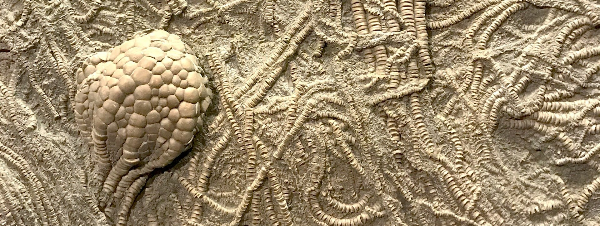

# Awesome Paleontology 

_A curated list of awesome resources for paleontology._

 Definition From Wikipedia 

> **Paleontology** or **palaeontology** is the scientific study of the life of the past, mainly but not exclusively through the study of [fossils](https://en.wikipedia.org/wiki/Fossils "Fossils"). Paleontologists use fossils as a means to classify [organisms](https://en.wikipedia.org/wiki/Organisms "Organisms"), measure [geologic time](https://en.wikipedia.org/wiki/Geologic_time "Geologic time"), and assess the interactions between [prehistoric](https://en.wikipedia.org/wiki/Prehistoric "Prehistoric") organisms and their [natural environment](https://en.wikipedia.org/wiki/Natural_environment "Natural environment"). While paleontological observations are known from at least the 6th century BC, the foundation of paleontology as a science dates back to the work of [Georges Cuvier](https://en.wikipedia.org/wiki/Georges_Cuvier "Georges Cuvier") in [1796](https://en.wikipedia.org/wiki/1796_in_paleontology "1796 in paleontology"). Cuvier demonstrated evidence for the concept of [extinction](https://en.wikipedia.org/wiki/Extinction "Extinction") and how life of the past was not necessarily the same as that of the present. The field developed rapidly over the course of the following decades, and the French word *paléontologie* was introduced for the study in [1822](https://en.wikipedia.org/wiki/1822_in_paleontology "1822 in paleontology"), which was derived from the [Ancient Greek](https://en.wikipedia.org/wiki/Ancient_Greek "Ancient Greek") word for 'ancient' and words describing relatedness and a field of study. Further advances in the field accompanied the work of [Charles Darwin](https://en.wikipedia.org/wiki/Charles_Darwin "Charles Darwin") who popularized the concept of [evolution](https://en.wikipedia.org/wiki/Evolution "Evolution"). Together, evolution and extinction can be understood as complementary processes which shaped the [history of life](https://en.wikipedia.org/wiki/History_of_life "History of life").
>
> Paleontology overlaps the most with the fields of [geology](https://en.wikipedia.org/wiki/Geology "Geology") and [biology](https://en.wikipedia.org/wiki/Biology "Biology"). It draws on technology and analysis of a wide range of sciences to apply them to the study of life and environments of the past, particularly for the subdisciplines of [paleobiology](https://en.wikipedia.org/wiki/Paleobiology "Paleobiology") and [paleoecology](https://en.wikipedia.org/wiki/Paleoecology "Paleoecology") that are analogous to biology and [ecology](https://en.wikipedia.org/wiki/Ecology "Ecology"). Paleontology also contributes to other sciences, being utilized for [biostratigraphy](https://en.wikipedia.org/wiki/Biostratigraphy "Biostratigraphy") to reconstruct the [geologic time scale](https://en.wikipedia.org/wiki/Geologic_time_scale "Geologic time scale") of Earth, or in studies on extinction to establish both external and internal factors that can lead to the disappearance of a [species](https://en.wikipedia.org/wiki/Species "Species"). Much of the history of life is now better understood because of advances in paleontology and the increase of [interdisciplinary studies](https://en.wikipedia.org/wiki/Interdisciplinary_studies "Interdisciplinary studies"). Several improvements in understanding have occurred from the introduction of theoretical analysis to paleontology in the 1950s and 1960s that led to the rise of more focused fields of paleontology that assess the changing [geography](https://en.wikipedia.org/wiki/Geography "Geography") and [climate](https://en.wikipedia.org/wiki/Climate "Climate") of Earth, the [phylogenetic](https://en.wikipedia.org/wiki/Phylogenetic "Phylogenetic") relationships between different species, and the analysis of how [fossilization](https://en.wikipedia.org/wiki/Fossilization "Fossilization") occurs and what biases can impact the quality of the [fossil record](https://en.wikipedia.org/wiki/Fossil_record "Fossil record").
>
> Paleontology is also one of the most high profile of the sciences, comparable to [astrophysics](https://en.wikipedia.org/wiki/Astrophysics "Astrophysics") and [global health](https://en.wikipedia.org/wiki/Global_health "Global health") in the amount of attention in [mass media](https://en.wikipedia.org/wiki/Mass_media "Mass media"). Public attention to paleontology can be traced back to the [mythologies](https://en.wikipedia.org/wiki/Mythologies "Mythologies") of [indigenous peoples](https://en.wikipedia.org/wiki/Indigenous_peoples "Indigenous peoples") of many continents and the interpretation of discovered fossils as the bones of [dragons](https://en.wikipedia.org/wiki/Dragon "Dragon") or [giants](https://en.wikipedia.org/wiki/Giant "Giant"). Prehistoric life is used as the inspiration for [toys](https://en.wikipedia.org/wiki/Toys "Toys"), television and [film](https://en.wikipedia.org/wiki/Film "Film"), [computer games](https://en.wikipedia.org/wiki/Computer_games "Computer games"), and [tourism](https://en.wikipedia.org/wiki/Tourism "Tourism"), with the budgets for these public projects often exceeding the funding within the field of paleontology itself. This has led to exploitation and [imperialism](https://en.wikipedia.org/wiki/Imperialism "Imperialism") of fossils collected for institutions in Europe and North America, and also appeals to the public for sponsorships to the benefit of some areas of paleontology at the detriment of others. [^wikipedia_citation]

[^wikipedia_citation]: Wikipedia contributors. "Paleontology." Wikipedia. Last modified October 24, 2025. Accessed October 24, 2025. <https://en.wikipedia.org/wiki/Paleontology>.

 [^image_attribution]

[^image_attribution]: Image used under the [Unsplash License](https://unsplash.com/license), i.e. "All images can be downloaded and used for free", "Commercial and non-commercial purposes", and "No permission needed (though attribution is appreciated!)". Image Link: <https://unsplash.com/photos/brown-and-white-pine-cones-on-brown-sand-Ca6SEzOGJDw>. Image Photographer: [Gabi Scott](https://unsplash.com/@gabrielle_ellecreative).

> [!NOTE]
>
> This list follows specific scoping guidelines. The **Books** section primarily contains textbooks. **Organizations** is divided into GitHub organizations and non-GitHub organizations. **Researchers** exclusively features researcher GitHub profiles. A **Reading Lists** section was chosen over individual papers, as managing the volume of papers on the topic at hand in a single list in untenable. **Repositories** targets larger work on GitHub and excludes, for example, standalone code for papers. **Datasets** includes only publicly accessible data. **Software** features notable tools, libraries, and frameworks not available on GitHub. **Websites** covers informational sites, news sources, and community hubs. **Educational Resources** includes tutorials, videos, and other learning materials.

## Contents

- [General Resources](#general-resources)
  - [Books](#books)
  - [Journals](#journals)
  - [Conferences](#conferences)
  - [Datasets](#datasets)
  - [Websites](#websites)
  - [Researchers](#researchers)
  - [Courses](#courses)
  - [Educational Resources](#educational-resources)
- [Paleobiology](#paleobiology)
  - [Reading Lists](#reading-lists)
  - [Repositories](#repositories)
  - [Software](#software)
- [Paleoecology](#paleoecology)
  - [Reading Lists](#reading-lists-1)
  - [Repositories](#repositories-1)
  - [Software](#software-1)
- [Paleogeography](#paleogeography)
  - [Reading Lists](#reading-lists-2)
  - [Repositories](#repositories-2)
  - [Software](#software-2)
- [Paleoclimatology](#paleoclimatology)
  - [Reading Lists](#reading-lists-3)
  - [Repositories](#repositories-3)
  - [Software](#software-3)
- [Systematic Paleontology](#systematic-paleontology)
  - [Vertebrate Paleontology](#vertebrate-paleontology)
  - [Invertebrate Paleontology](#invertebrate-paleontology)
  - [Paleobotany](#paleobotany)
  - [Micropaleontology](#micropaleontology)
  - [Software](#software-4)
- [Methods and Techniques](#methods-and-techniques)
  - [Reading Lists](#reading-lists-4)
  - [Repositories](#repositories-4)
  - [Software](#software-5)
- [Contribution](#contribution)
- [License](#license)

## General Resources

### Books

1. [Bringing Fossils to Life: An Introduction to Paleobiology](https://www.amazon.com/Bringing-Fossils-Life-Introduction-Paleobiology/dp/0231158270): Donald R. Prothero's comprehensive textbook.
2. [Principles of Paleontology](https://www.amazon.com/Principles-Paleontology-David-M-Raup/dp/0716706121): Classic text by Raup and Stanley.
3. [Paleobiology: A Synthesis](https://www.wiley.com/en-us/Paleobiology%3A+A+Synthesis-p-9780632034727): Derek Briggs and Peter Crowther's comprehensive overview.
4. [Vertebrate Paleontology](https://www.wiley.com/en-us/Vertebrate+Paleontology%2C+4th+Edition-p-9781118406847): Michael Benton's definitive textbook.
5. [Invertebrate Palaeontology and Evolution](https://www.wiley.com/en-us/Invertebrate+Palaeontology+and+Evolution%2C+4th+Edition-p-9780632052387): E.N.K. Clarkson's classic work.
6. [The Paleobiological Revolution: Essays on the Growth of Modern Paleontology](https://press.uchicago.edu/ucp/books/book/chicago/P/bo5936935.html): Sepkoski and Ruse on the history of paleobiology.

### Journals

1. [Journal of Paleontology](https://www.cambridge.org/core/journals/journal-of-paleontology): Official journal of the Paleontological Society.
2. [Paleobiology](https://www.cambridge.org/core/journals/paleobiology): Focuses on biological aspects of the fossil record.
3. [Palaeontology](https://www.palass.org/publications/palaeontology-journal): Published by the Palaeontological Association.
4. [Palaeogeography, Palaeoclimatology, Palaeoecology](https://www.journals.elsevier.com/palaeogeography-palaeoclimatology-palaeoecology): Multidisciplinary earth science journal.
5. [Cretaceous Research](https://www.journals.elsevier.com/cretaceous-research): Focused on the Cretaceous Period.
6. [Acta Palaeontologica Polonica](https://www.app.pan.pl/): Open access international journal.
7. [PLOS ONE - Paleontology](https://journals.plos.org/plosone/): Open access articles on paleontology.

### Conferences

1. [Geological Society of America (GSA) Annual Meeting](https://www.geosociety.org/GSA/Events/Annual_Meeting/GSA/Events/gsa2024.aspx): Major meeting with extensive paleontology sessions.
2. [Society of Vertebrate Paleontology (SVP) Annual Meeting](http://vertpaleo.org/): Premier vertebrate paleontology conference.
3. [Paleontological Society Annual Meeting](https://paleosoc.org/): Often held jointly with GSA, focused on invertebrate paleontology.
4. [Palaeontological Association Annual Meeting](https://www.palass.org/meetings-events): Major UK-based paleontology conference.
5. [International Palaeontological Congress (IPC)](https://internationalpalaeo.org/): Quadrennial global paleontology meeting.
6. [North American Paleontological Convention (NAPC)](https://www.paleosoc.org/): Held every 4-5 years in North America.

### Datasets

1. [Paleobiology Database (PBDB)](https://paleobiodb.org/): Comprehensive database of fossil occurrences and taxonomy.
2. [Fossilworks](http://fossilworks.org/): Portal to the Paleobiology Database with enhanced search features.

### Websites

1. [The Paleontology Portal](http://www.paleoportal.org/): Educational resource with fossil galleries and information.
2. [Paleontologia Electronica](https://palaeo-electronica.org/): Open access journal and resource.
3. [Digital Atlas of Ancient Life](https://www.digitalatlasofancientlife.org/): 3D models and educational materials.

### Researchers

1. [Shanan Peters](https://github.com/cambro): UW-Madison geoscientist developing paleobiological databases and Macrostrat.
2. [Ádám T. Kocsis](https://github.com/adamkocsis): Developer of divDyn and chronosphere R packages for paleobiology.
3. ...

### Courses

1. [Paleontology: Ancient Marine Reptiles (Coursera)](https://www.coursera.org/learn/ancient-marine-reptiles): University of Alberta course on marine reptile evolution.
2. [Paleontology: Theropod Dinosaurs and the Origin of Birds (Coursera)](https://www.coursera.org/learn/dino101): University of Alberta dinosaur evolution course.
3. [Introduction to Paleobiology (MIT OpenCourseWare)](https://ocw.mit.edu/courses/earth-atmospheric-and-planetary-sciences/): Free MIT paleontology course.
4. [Paleontology (Yale Open Courses)](https://oyc.yale.edu/ecology-and-evolutionary-biology): Yale course on evolutionary history of life.
5. [History of Earth (Coursera)](https://www.coursera.org/learn/history-earth): University of Copenhagen course covering paleontology and geology.

### Educational Resources

1. [University of California Museum of Paleontology](https://ucmp.berkeley.edu/): Educational materials and online exhibits.
2. [Smithsonian National Museum of Natural History - Paleobiology](https://naturalhistory.si.edu/research/paleobiology): Resources and collections information.
3. [Understanding Evolution](https://evolution.berkeley.edu/): Educational resource on evolution and paleontology.
4. [Paleocast](http://www.paleocast.com/): Podcast discussing paleontology research.

## Paleobiology

### Reading Lists

1. [O957's Papers - Paleobiology](assets/o957_reading_list.md#paleobiology)

### Repositories

1. [paleotree](https://github.com/dwbapst/paleotree): R package for paleontological and phylogenetic analyses of evolution.
2. [divDyn](https://github.com/adamkocsis/divDyn): R package for diversity dynamics using fossil occurrence data.
3. [PaleoPhyloR](https://github.com/graemetlloyd/Claddis): R package for phylogenetic paleobiology.
4. [fossilbrush](https://github.com/palaeoverse/fossilbrush): R package for cleaning and preparing fossil occurrence data.

### Software

1. [PAST](https://www.nhm.uio.no/english/research/resources/past/): Paleontological statistics software.
2. [R](https://www.r-project.org/): Statistical computing widely used for paleobiological analysis.
3. [Mesquite](https://www.mesquiteproject.org/): Software for phylogenetic analysis and character evolution.

## Paleoecology

### Reading Lists

1. [O957's Papers - Paleoecology](assets/o957_reading_list.md#paleoecology)

### Repositories

1. [palaeoverse](https://github.com/palaeoverse/palaeoverse): R package for preparing and exploring paleobiological data.
2. [chronosphere](https://github.com/adamkocsis/chronosphere): R package for spatiotemporal data in Earth sciences.
3. [paleobuddy](https://github.com/brpetrucci/paleobuddy): R package for simulating diversification and fossil sampling.

### Software

1. [PAST](https://www.nhm.uio.no/english/research/resources/past/): Statistical analysis for paleoecological data.
2. [R](https://www.r-project.org/): Statistical environment for ecological analysis.
3. [Paleontological Network Analysis Tools](https://www.paleo-networks.org/): Network analysis for paleocommunities.

## Paleogeography

### Reading Lists

1. [O957's Papers - Paleogeography](assets/o957_reading_list.md#paleogeography)

### Repositories

1. [GPlates](https://github.com/GPlates): Software for interactive visualization of plate tectonics.
2. [rgplates](https://github.com/adamkocsis/rgplates): R package interface to GPlates Web Service.
3. [chronosphere](https://github.com/adamkocsis/chronosphere): Spatiotemporal data for Earth history.
4. [paleoMap](https://github.com/scotese/paleoMap): Tools for paleographic reconstructions.

### Software

1. [PaleoGIS](https://www.paleogis.com/): Geographic information systems for paleogeography.
2. [GeoMapApp](http://www.geomapapp.org/): Marine geospatial data exploration tool.

## Paleoclimatology

### Reading Lists

1. [O957's Papers - Paleoclimatology](assets/o957_reading_list.md#paleoclimatology)

### Repositories

1. [chronosphere](https://github.com/adamkocsis/chronosphere): Spatiotemporal data for Earth history.

### Software

1. [Climate Data Analysis Tools](https://www.ncdc.noaa.gov/data-access): NOAA paleoclimate data tools.
2. [Paleoclimate Modelling Intercomparison Project](https://pmip.lsce.ipsl.fr/): Climate modeling software and data.
3. [R](https://www.r-project.org/): Statistical computing for paleoclimate analysis.

## Systematic Paleontology

### Vertebrate Paleontology

1. [Vertebrate Palaeontology](https://www.wiley.com/en-us/Vertebrate+Paleontology): Benton's comprehensive textbook.
2. [The Rise of Fishes](https://www.amazon.com/Rise-Fishes-Million-Evolution-Revised/dp/0801888948): John Long on early vertebrate evolution.
3. [Dinosauria](https://www.ucpress.edu/book/9780520242098/the-dinosauria): Weishampel, Dodson, and Osmólska's definitive reference.
4. [The Complete Dinosaur](https://www.amazon.com/Complete-Dinosaur-Life-Past-Present/dp/0253357012): Comprehensive dinosaur encyclopedia.
5. [The Evolution of Mammalian Characters](https://www.cambridge.org/core/books/evolution-of-mammalian-characters/8F9E9E7E8E9E8E9E8E9E8E9E8E9E8E9E): Luo on mammalian origins.

### Invertebrate Paleontology

1. [Treatise on Invertebrate Paleontology](https://www.paleo.ku.edu/treatise): Comprehensive multi-volume reference work.
2. [The Fossil Record of Bivalves](https://www.cambridge.org/core/books/fossil-record-of-bivalves): Comprehensive review.
3. [Trilobite Paleobiology](https://www.wiley.com/en-us/Trilobites-p-9781405149143): Fortey and Thomas overview.

### Paleobotany

1. [Paleobotany: The Biology and Evolution of Fossil Plants](https://www.amazon.com/Paleobotany-Biology-Evolution-Fossil-Plants/dp/0123739721): Taylor, Taylor, and Krings comprehensive textbook.
2. [The Evolution of Plants](https://global.oup.com/academic/product/the-evolution-of-plants-9780199292233): Willis and McElwain overview.

### Micropaleontology

1. [Introduction to Marine Micropaleontology](https://www.amazon.com/Introduction-Marine-Micropaleontology-Bilal-Haq/dp/0444527990): Haq and Boersma.
2. [Foraminifera](https://www.wiley.com/en-us/Foraminifera-p-9781118390153): Sen Gupta comprehensive treatment.
3. [Nannofossils and their Applications](https://www.cambridge.org/core/books/nannofossils-and-their-applications): Bown overview.

### Software

1. [MorphoJ](https://morphometrics.uk/MorphoJ_page.html): Integrated software for geometric morphometrics.
2. [PAST](https://www.nhm.uio.no/english/research/resources/past/): Paleontological statistics software.
3. [Mesquite](https://www.mesquiteproject.org/): Software for phylogenetic analysis.
4. [TNT](http://www.lillo.org.ar/phylogeny/tnt/): Tree analysis for phylogenetic inference.

## Methods and Techniques

### Reading Lists

1. [O957's Papers - Methods and Techniques](assets/o957_reading_list.md#methods-and-techniques)

### Repositories

1. [paleobioDB R package](https://github.com/ropensci/paleobioDB): R interface to Paleobiology Database.
2. [fossilbrush](https://github.com/palaeoverse/fossilbrush): Data cleaning for fossil occurrences.
3. [Morpho](https://github.com/zarquon42b/Morpho): R package for geometric morphometrics.
4. [phytools](https://github.com/liamrevell/phytools): R package for phylogenetic comparative methods.
5. [strap](https://github.com/graemetlloyd/strap): R package for stratigraphic tree analysis.

### Software

1. [PAST](https://www.nhm.uio.no/english/research/resources/past/): Paleontological statistics software.
2. [R](https://www.r-project.org/): Statistical computing widely used in paleontology.
3. [Python](https://www.python.org/): Programming language for data analysis and visualization.
4. [MorphoJ](https://morphometrics.uk/MorphoJ_page.html): Integrated software for geometric morphometrics.
5. [BEAST](https://beast.community/): Bayesian evolutionary analysis by sampling trees.
6. [FigTree](http://tree.bio.ed.ac.uk/software/figtree/): Graphical viewer of phylogenetic trees.

## Contribution

Notice anything missing that would be a good fit? If interested in contributing, please see the [contributing file](./CONTRIBUTING.md) for further direction.

## License

To the extent possible under law, [O957](https://github.com/O957) has waived all copyright and related or neighboring rights to this work.
